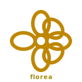

<p align="center">
  
</p>

<h1 align="center">🌸 florea</h1>

<p align="center"><strong>Floréa</strong> — cosmetic · aesthetic · skincare · perfumery substrate · 7-verb HEXA-standalone library · Lumière brand</p>

<p align="center">
  <a href="LICENSE"></a>
  <a href="hexa.toml"></a>
  
  
  
</p>

<p align="center">cosmetic · aesthetic · skincare · perfumery · hair · tattoo · intimate-care · 7-verbs · n=6 · standalone-brand</p>

---

`florea` (display: **Floréa**) is the 🌸 cosmetic / aesthetic / skincare / perfumery substrate of the HEXA family — a 7-verb closed-form spec catalog organized around the `n=6` invariant lattice. Verbs migrated from `hexa-medic` (6 verbs) + `hexa-bio` electronic-skin (1 verb: skincare) on 2026-05-12. Standalone brand (Lumière-style, no `hexa-` prefix).

> [!NOTE]
> Member of the HEXA family (`n=6` invariant lattice). Per [`echoes/LATTICE_POLICY.md`](https://github.com/dancinlab/echoes/blob/main/LATTICE_POLICY.md), the n=6 lattice is an organizing tool, not a derivation substitute. Consumer-facing aesthetic brand identity → no `hexa-` prefix.

## Why Floréa?

`Floréa` is the 🌸 cosmetic/aesthetic member of the HEXA family. It carries the
미용 (beauty) verbs that were originally bundled into `hexa-medic` but didn't
fit a medicine·pharmacology·oncology·virology substrate — cosmetic surgery,
aesthetic skincare, hair regeneration, perfumery, body-care, and aesthetic
procedures.

The name `Floréa` (불어: flore + -éa diminutive) follows the standalone-brand
convention (like `Lumière` for camera filter, `Pâtisserie` for bakery) — a
HEXA family member without the `hexa-` prefix because it ships as a
consumer-facing aesthetic brand identity rather than a tooling/substrate.

GitHub URL slug: `dancinlab/florea` (no accent in URL); display name: **Floréa**.

## n=6 master identity

```
σ(6) · φ(6) = n · τ(6) = J₂ = 24
12   ·  2   = 6 ·  4   = 24
```

7 cosmetic verbs at v0.1.0 (initial migration + hexa-skin absorption).
Future v1.x may expand toward σ(6)=12 cosmetic surface verbs (makeup
chemistry, fragrance composition, body-care, hair-coloring,
aesthetic-device-class, anti-aging actives).

## Status

- v0.1.0 — initial migration (2026-05-12) + hexa-skin absorption
- 7 verbs · `cosmetic_surgery` · `hair_regeneration` · `mens_intimate_cleanser` · `perfumery` · `skincare` · `tattoo_removal` · `womens_intimate_cleanser`
- public · MIT · standalone brand (no `hexa-` prefix)
- HEXA family member · n=6 invariant lattice

## Install

```sh
# 1. Install hexa-lang (gives you `hexa` + `hx` package manager)
/bin/bash -c "$(curl -fsSL https://raw.githubusercontent.com/dancinlab/hexa-lang/main/install.sh)"

# 2. Install florea
hx install florea
```

## Run

```sh
florea list             # verb table
florea selftest         # 7-verb spec presence sweep
florea <verb>           # read a verb spec (cosmetic_surgery / hair_regeneration / mens_intimate_cleanser / perfumery / skincare / tattoo_removal / womens_intimate_cleanser)
florea version          # print version
florea help             # full help (subcommands + flags + env)
```

## Repo layout

```
florea/
├── AGENTS.tape                  # governance + identity (.tape v1.2)
├── CLAUDE.md                    # symlink → AGENTS.tape
├── CITATION.cff                 # citation metadata
├── hexa.toml                    # package manifest
├── LICENSE                      # MIT
├── README.md                    # this file (atlas/README-FORMAT.md compliant)
├── TAPE-AUDIT.md                # .tape v1.x adoption audit ledger
├── cli/                         # florea CLI driver
├── cosmetic-surgery/            # verb 1 · spec
├── hair-regeneration/           # verb 2 · spec
├── mens-intimate-cleanser/      # verb 3 · spec
├── perfumery/                   # verb 4 · spec
├── skincare/                    # verb 5 · spec (from hexa-bio)
├── tattoo-removal/              # verb 6 · spec
├── womens-intimate-cleanser/    # verb 7 · spec
├── papers/                      # supporting literature
├── tests/                       # selftest fixtures
├── state/                       # runtime markers (gitignored)
└── docs/
    └── logo.svg                 # repo logo (gold #bf8700)
```

## Origin

Migrated from the (now-deleted) `dancinlab/hexa-medic` 24-verb library
(cycle-30++++++ decomposition, 2026-05-12). `hexa-medic` repo was fully
decomposed (24 → 0 verbs) and removed; per-file canon@ded52144 lineage
annotations preserved in each verb's frontmatter. See [`dancinlab/hexa-bio`](https://github.com/dancinlab/hexa-bio)
`DECOMPOSITION_PLAN.md` for the full hexa-medic → Floréa + hexa-bio +
hexa-matter + deletion split rationale.

## Cross-link

- Family root: [`dancinlab/hexa-meta`](https://github.com/dancinlab/hexa-meta)
- Sibling: ~~`dancinlab/hexa-medic`~~ — **DELETED 2026-05-12**; was the
  source repo for 6 of Floréa's 7 verbs before full decomposition
- Sibling: [`dancinlab/hexa-bio`](https://github.com/dancinlab/hexa-bio) — 5-axis drug-discovery framework

## License

[MIT](LICENSE) — permissive, do-as-thou-wilt.
